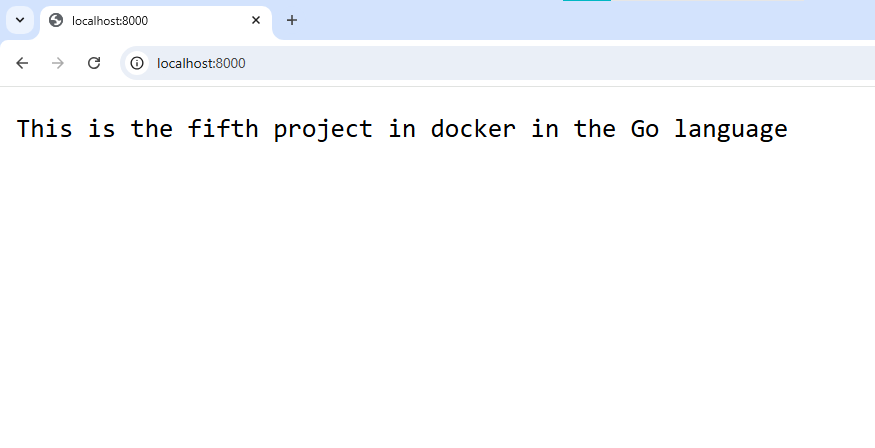
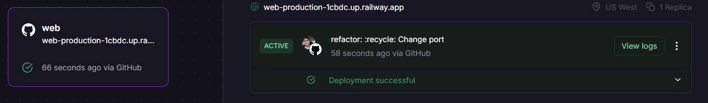
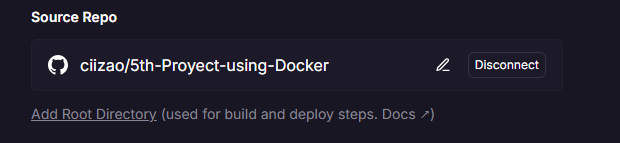
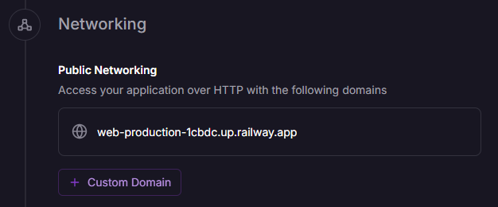
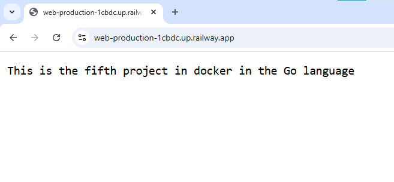

# Message whith GO
## Results

<p align="center">
    
</p>

This is a program that presents a message on the web with Go

## :open_book: Repository on Github
* Clone the repository

    ```
    git clone https://github.com/ciizao/5th-Proyect-using-Docker.git
    ```

## :rocket: How to run in docker
### Pre-requisites
* Docker - DockerDesktop installed
* DockerHub account
### Download image

*Image in the DockerHub repository and how to use it

```
https://hub.docker.com/repository/docker/ciizao/5th-proyect-using-docker-go
```
```
docker pull ciizao/5th-proyect-using-docker-go
```
> [!IMPORTANT]
> By default, port 8000 is the one assigned to open the web page
### Run image
```
docker run --name <NEWCONTAINERNAME> -p 8000:8000 <IMAGENAME>
```
> [!TIP]
> The name of the downloaded image must match the one placed in the previous command, for this you can verify it using the **docker images** command. Additionally, you must check that there is no other container with the same name as the one placed in the command.
> [!TIP]
> Check if the port is not being used with the command: netstat -aon | findstr :8000
> If it is busy we can stop the process with the command: taskkill /PID <PID> /F

### View the results
Open new window browser and search localhost:8000

[View results](#results)

## :light_rail: PAAS Deploy with docker (Railway)
For its deployment in a PAAS we will rely on railway and its easy implementation thanks to its container management. 




> [!IMPORTANT]
> Next, the configuration that we must add is the generation of a domain along with the desired port, in this case the indicated thing would be to point to port 8000





### View the results

This is the result of deploying in Railway through the created domain




Link Railway App
[Message](https://web-production-1cbdc.up.railway.app "click for visit")